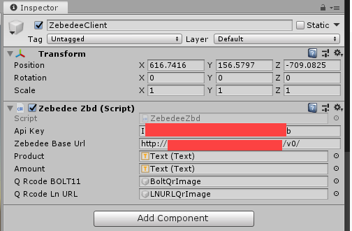
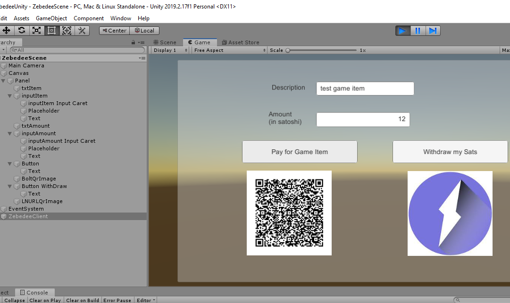
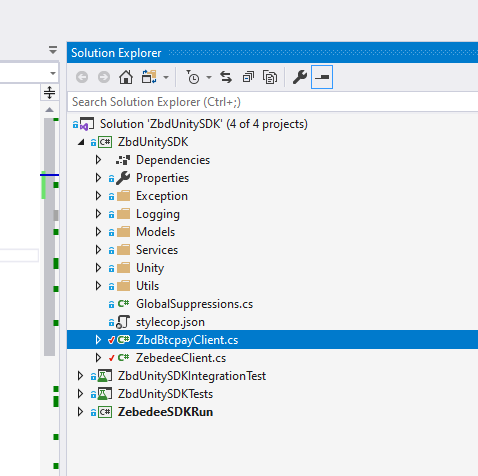
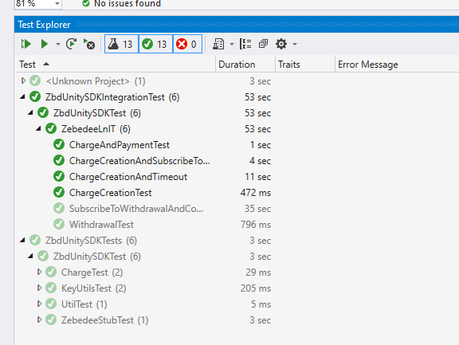

# ZEBEDEE Unity SDK

The ZEBEDEE Unity SDK allows developers to easily integrate Bitcoin Lightning microtransactions into their games and digital experiences. The SDK aims to provide helper methods to improve upon developer experience. The following backend systems are available for the Unity SDK:

1. [ZEBEDEE Lightning API](https://zebedee.io)
2. BTCPay Server API

# ZEBEDEE Lightning API

## General Information

The current ZEBEDEE API exposes 3 major entities and endpoints:

| ZEBEDEE API     |    Use Case   |
|----------|---------------------------|
| Charge   | Shows QR code with Invoice (BOLT 11) that Player can pay for in satoshis. |
| Withdraw | Shows QR code with LNURL Invoice that allows Player to Withdraw satoshis. |
| Payment  | Scans the Invoice (BOLT11) QR code from Player's wallet and pays satoshis. |

The SDK exposes a set of helper methods, including a client constructor that facilitates the interaction with the ZEBEDEE APIs.

## API Client Constructor

ZEBEDEE Client is the only object with which Unity C# code interacts with. The constructor requires a `zebedeeBaseURL` and a `apikey`. You can get those and more documentation at the [ZEBEDEE website](http://zebedee.io). Developers can get an API Key from the Developer Dashboard -> Games -> Create a New Game. API calls without an API Key will fail.

```csharp
    public string zebedeeBaseUrl;   //set host from inspector
    public string apiKey;           //set pairing code from inspector
    
    private ZebedeeClient zbdClient = null;

    public void Start()
    {
        zbdClient = new ZebedeeClient(zebedeeBaseUrl, apiKey);
    }
```
Developers can also pass these settings via the Public Properties of Unity Game object. See below for reference.



## CreateInvoice Method

The `CreateChargeAsync` method is used to generate BOLT11 Invoices. The method expects an `AmountInSatoshi` and a `description`. It is commonplace to showcase the Invoice in a QR code format, for users and players to scan.
As soon as the Invoice is generated in the ZEBEDEE backend services, the callback method is executed with the corresponding BOLT11 Invoice string returned (e.g. `lnbc125bj1...`).

```csharp
//New Charge Preparation
Charge charge = new Charge();
charge.Description = product.text;
charge.AmountInSatoshi = int.Parse(amount.text);

//Create Charge object and get the BOLT11 invoice from ZEBEDEE backend
await zbdClient.CreateChargeAsync(charge, handleInvoice);
```

## Withdraw Method

ZEBEDEE `WithdrawAsync` method is used to generate LNURL strings for withdrawing funds. The method expects an `AmountInSatoshi` and a `description`. Developers are encouraged to show these as QR codes so players and users can scan them.
As soon as the Withdrawal Request LNURL is generated the callback method is executed with the LNURL string returned.

```csharp
//New Withdraw Preparation
Withdraw withdraw = new Withdraw();
withdraw.Description = product.text;
withdraw.AmountInSatoshi = int.Parse(amount.text);

//Create withdraw with ZEBEDEE backend and get lnurl
await zbdClient.WithDrawAsync(withdraw, handleWithdrawal);
```

## SubscribeChargeAsync Method
In order to get information about the status of a recently created Invoice, one can use the `SubscribeChargeAsync` method. This allows developers to respond to any updates on the status of a payment inside of their applications and games.
For example, showing **Paid Invoice** image.
```csharp
//Subscribe the get notified about payment status
string status = await zbdClient.SubscribeChargeAsync(chargeId);
```

## SubscribeWithDrawAsync Method
In order to get information about the status of a recently created Withdrawal Request, one can use the `SubscribeWithDrawAsync` method. This allows developers to respond to any updates on the status of a withdrawal inside of their applications and games.
For example, showing **Withdrawal Complete** image.
```csharp
 //Subscribe the an callback method with invoice ID to be monitored
string status = await zbdClient.SubscribeWithDrawAsync(withdraw.Data.Id);
```

## Payment Method
In case the Player's wallet does not support LNURL QR codes, you may pay an invoice directly. Game developers can possibly implement an input for user to paste an invoice, or even a webcam feature to scan the Invoice QR code on the Player's phone.

# Examples / Demo Implementation
This repository also contains a Sample Unity project under `/<Project Folder>/Unity/ZebedeeUnity/`. To run the project, follow the steps below:

1. Open this folder with the latest Unity software.
2. Open the ZEBEDEE scene.
3. Set the ZEBEDEE URL and your API Key (found in ZEBEDEE's Developer Dashboard) on the Game Object *ZebedeeClient*
4. Start the game.
5. Test Player paying to the Game (Genarating BOLT Invoice)
   1. Input Description and Amount in satoshis
   2. Click "Pay for Game Item"
   3. Open you lightning wallet and SCan the QR code
   4. QR image turns in to Paid Image
6. Test Player withdrawing from the Game (Generating LNURL withdraw)
   1. Input Description and Amount in satoshis
   2. Click "Withdraw my Sats"
   3. Open you LNURL-supported lightning wallet and scan
   4. QR image turns in to Withdraw Complete Image




# Project Structure
1. ZbdUnitySDK Main Project
   1. Exception  API Implementation Specific Exception
   2. Logging which supports both Unity Runtime and non-Unity(Console) Runtime
   3. Models Common Classes and API Speicic Request/Response Classes
   4. Services  API Implementation Specific Service classes
   5. Unity Unity specific class , Coroutine returning Data
   6. Utils  Common Utility classes , Encryption ,File access ,Unity Asset Access
   7. ZbdBtcpayClient  Facade client class to use BTCPay server's API(In Development)
   8. ZebedeeClient  Facade client class to use Zebedee API
2. ZbdUnitySDKIntegrationTest  Integration Tests with main ZEBEDEE API server (Most Important Test)
3. ZbdUnitySDKTests Unit tests
4. ZebedeeSDKRun    To test Logging by running on Console
   



# Contribution
Make sure all the tests(Unit tests/Integration tests) passed before push the commits.



# Acknowledgement
This SDK depends on several opensource projects below.

| Project     |  License   |  URL   |
|----------|----------------|-----------|
| Bitpay Csharp client| MIT | https://github.com/bitpay/csharp-bitpay-client#license|
| NBitcoin            | MIT | https://github.com/MetacoSA/NBitcoin/blob/master/LICENSE |
| BouncyCastle.Crypto | MIT | http://www.bouncycastle.org/csharp/licence.html|
| log4net             | Apache 2.0 |https://logging.apache.org/log4net/license.html|
| Multibase           | MIT | https://logging.apache.org/log4net/license.html|
| NewtonJson          | MIT | https://github.com/JamesNK/Newtonsoft.Json/blob/master/LICENSE.md|

